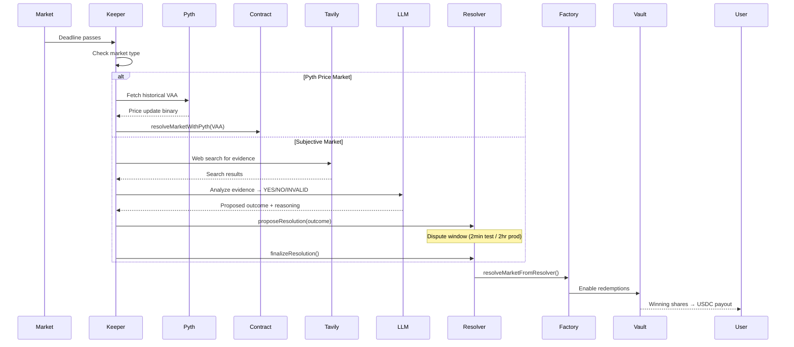

# Verity


> A social prediction network where opinions become USDC-backed markets.

## Problem Statement

Social media is full of opinions, but opinions are cheap when there's nothing at stake.

- Hot takes flood feeds with zero accountability.
- There's no mechanism to separate genuine conviction from performative commentary.
- Prediction markets exist, but they're isolated from the social graphs where discourse actually happens.

## Solution

Verity merges social media with on-chain prediction markets, letting users put USDC behind their opinions on the Arc Testnet.

1. **Social-First Markets**
   - Any post can become a YES/NO prediction market with clear resolution criteria, a deadline, and a verifiable source.
2. **Community Signal Layer**
   - Free daily Upvote/Downvote signals let the community qualify which ideas deserve real liquidity, before any money is at stake.
3. **On-Chain AMM Trading**
   - Qualified markets graduate to USDC-backed FPMM pools where users buy and sell outcome tokens at market-driven prices.
4. **Autonomous Resolution**
   - An AI agent powered by configurable LLMs (Claude, Gemini, OpenAI) and Tavily web search automatically resolves expired markets. Pyth price feeds handle objective price-based markets.

## How It Works

### 1. Market Lifecycle

A prediction market on Verity follows a progressive lifecycle:

```plaintext
Post Created → Open for Votes → Qualified (50+ signals)
→ Funding Pool (USDC deposits) → Tradable (AMM live)
→ Resolving → Resolved (YES/NO payout)
```

### 2. Trading Mechanics

Users buy outcome tokens (YES or NO shares) through a Fixed Product Market Maker. Prices shift based on demand — the more people buy YES, the higher the YES price.

```javascript
// Buy YES tokens on a market
const trade = {
  marketId: '...',
  side: 'YES',
  amountUsdc: 10,
  tradingFeeBps: 200, // 2% fee
}
```

### 3. Resolution Flow



## Architecture

```plaintext
Verity/
├── contracts/           # Foundry Smart Contracts (Solidity)
│   └── src/
│       ├── ConditionalTokenVault.sol   # USDC escrow + outcome token minting
│       ├── VerityMarketFactory.sol     # Market registry + pool deployment
│       ├── VerityFPMM.sol              # Fixed Product Market Maker (AMM)
│       ├── VerityOptimisticResolver.sol # Dispute-window resolution system
│       └── VerityRouter.sol            # One-click user actions proxy
├── backend/             # NestJS 11 API Server
│   └── src/
│       ├── modules/
│       │   ├── agent/           # AI resolution agent (Claude/Gemini/OpenAI)
│       │   ├── auth/            # Privy JWT auth + database-first guard
│       │   ├── blockchain/      # Viem on-chain reads/writes + AA decoder
│       │   ├── liquidity/       # LP pool state, positions, chain sync
│       │   ├── markets/         # Market CRUD, voting, trading, keeper loop
│       │   ├── notifications/   # Activity feed notifications
│       │   ├── posts/           # Social feed + market post creation
│       │   ├── socket/          # WebSocket real-time updates
│       │   └── users/           # Wallet profiles + signal tracking
│       └── common/              # Guards, filters, interceptors
└── frontend/            # Next.js (App Router) + React 19
    └── src/
        ├── app/                 # Pages: feed, markets, profile, wallet, notifications
        ├── components/          # Feed, market cards, onboarding modal, layout
        ├── hooks/               # Market liquidity, USDC transfers, portfolio, socket
        ├── lib/                 # Arc chain config, contract ABIs, type definitions
        └── store/               # Zustand stores + TanStack Query API layer
```

## Core Components

### Smart Contracts (Foundry / Solidity 0.8.24)

Five contracts deployed on Arc Testnet handle the full market lifecycle: a **ConditionalTokenVault** for USDC escrow and outcome token minting, a **VerityMarketFactory** for market registration and automatic pool deployment, a **VerityFPMM** for AMM trading, and a **VerityOptimisticResolver** for dispute-window based resolution

### Backend API (NestJS 11)

A modular REST API with Swagger documentation, Privy-based JWT authentication with database-first lookups, WebSocket broadcasting for real-time feed updates, and an automated keeper service that resolves expired markets every 30 seconds using AI agents or Pyth price oracles.

### Frontend (Next.js + React 19)

A premium social feed interface with Privy smart wallet onboarding (Account Abstraction), USDC-backed market trading, daily free signal voting, real-time WebSocket updates, and a responsive dark/light theme system.

## Getting Started

### 1. Prerequisites

- **Node.js 18+** & **pnpm**
- **MongoDB** (local or remote)
- **Foundry** (for contract development)

### 2. Setup Environment

Clone and install dependencies:

```bash
git clone https://github.com/JWattjr/Verity.git
cd Verity
pnpm install
```

Configure the services:

```bash
# Backend configuration
cd backend && cp .env.example .env

# Frontend configuration
cd ../frontend && cp .env.example .env
```

### 3. Build & Deploy Contracts

If you wish to deploy your own instance of the contracts:

```bash
cd contracts
forge build
forge script script/Deploy.s.sol:Deploy \
  --rpc-url https://rpc.testnet.arc.network \
  --private-key <YOUR_PRIVATE_KEY> \
  --broadcast
```

### 4. Boot the Ecosystem

Run the frontend and backend concurrently:

```bash
# Terminal 1
pnpm dev:backend

# Terminal 2
pnpm dev:frontend
```

## How to Test the Product

1. **Log In**: Visit `http://localhost:3000` and sign in with your email via Privy.
2. **Onboard**: Activate your smart wallet, choose a username, and fund with testnet USDC from the faucet.
3. **Post a Claim**: Create a normal post or a prediction market with a clear question, YES/NO conditions, a deadline, and a resolution source.
4. **Signal Conviction**: Cast free daily Upvote/Downvote signals on market posts to help them qualify.
5. **Fund a Market**: Once a market qualifies (50+ signals), deposit USDC into the launch pool. The pool deploys automatically when it reaches 40 USDC.
6. **Trade Outcomes**: Buy YES or NO shares on active markets. Watch prices move based on demand.
7. **Watch Resolution**: After the deadline, the AI keeper automatically proposes and finalizes the outcome. Winning shares can be redeemed for USDC.

---

<p align="center">Built for the Arc Testnet</p>
